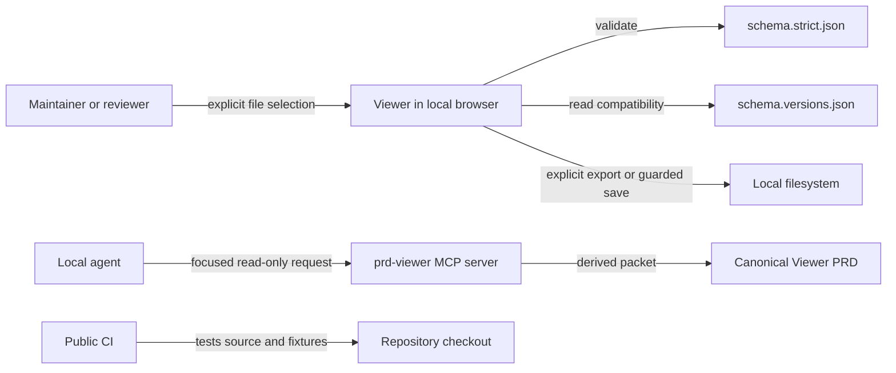

# PRD Viewer technical design

## Purpose and scope

The Viewer is a local-first React application for opening, validating, reviewing,
editing, and exporting canonical PRD JSON. `viewer/PRD_web_ui.json` owns product
intent; this TRD owns the implementation and verification design.

Public repository publication does not change the runtime trust model. It does
not add hosting, authentication, reviewer identity, comments, remote telemetry,
or a server-side copy of PRD content. Those capabilities remain outside the
local MVP and require separate PRD, privacy, and deployment review.

## Architecture and trust boundaries

- The browser and local MCP process are trusted to read local artifacts.
- PRD content stays on the local machine unless a user explicitly exports it.
- The File System Access API write path validates the complete document before
  replacing a file and retains the last valid in-memory document on failure.
- The MCP surface is local-only and read-only. Its indexes, packets, reports,
  diagnostics, and metrics are derived and rebuildable.
- Public CI receives only committed source, fixtures, schemas, and documentation;
  it must not require PRD content, credentials, or environment secrets.

## Interfaces and data ownership

| Interface | Contract | Ownership |
| --- | --- | --- |
| PRD load, edit, export, and save | `schema.strict.json` and deterministic JSON serialization | Canonical PRD file |
| Compatibility status | `schema.versions.json` plus `meta.schema_contract` | Repository schema contract |
| Focused agent reads | `prd.config.json` selects the canonical PRD; MCP tools remain read-only | Canonical PRD file |
| Review and project status exports | Derived HTML or JSON snapshots | Rebuildable Viewer output |
| Public validation | Locked npm dependencies and repository scripts | CI workflow |

There is no HTTP API for the Viewer MVP, so no OpenAPI contract is required.
The optional MCP HTTP transport remains localhost-only and does not make the
Viewer a hosted service.

## Key runtime sequences

### Open and edit

1. The user selects a local JSON file.
2. The Viewer parses and validates the complete document.
3. Only a valid document replaces the active session.
4. Structured or raw edits remain pending until complete-document validation
   succeeds.
5. Export or save occurs only after explicit user action.

### Focused MCP context

1. The local server discovers `prd.config.json` from the active project root.
2. `prd.path` resolves relative to that root.
3. An agent searches compact indexed entities.
4. The agent requests a standard, token-budgeted packet with an explicit preset.
5. The canonical JSON remains unchanged; metrics contain metadata, not PRD text.

### GitHub execution tracking

1. A coherent deliverable is represented by one PRD `PTW-###`.
2. Independently assignable slices are GitHub issues linked through the PTW's
   `external_refs`; GitHub Projects may schedule those issues.
3. Work splits into separate issues when slices need different owners, pull
   requests, blockers, verification, trust boundaries, or more than three
   focused delivery days.
4. Each pull request references its PTW and closes its GitHub issue.
5. `tools/validate_delivery_tracking.py` rejects non-GitHub tracking URLs,
   active PTWs without an issue, and pull requests without both links.
6. The GitHub ruleset makes the governance check required on the default branch.

The PRD stores durable delivery summaries. GitHub owns assignees, discussion,
checklists, scheduling, and live status. Jira and other ticket systems are not
part of the framework workflow.

## Public repository and release design

- Public-facing documentation states setup, contribution, security reporting,
  local-data boundaries, and the current licensing state.
- Generated browser output, local metrics, dependencies, and build products are
  ignored and are not release inputs.
- CI installs from lockfiles and runs deterministic root, MCP, and Viewer gates.
- The repository-wide Apache License 2.0 covers the code, schemas, templates,
  documentation, Viewer, and PRD Context plugin under one permissive license
  with an explicit patent grant.
- Public release uses a new repository initialized from a sanitized current-tree
  snapshot. No Git objects, refs, or remotes are copied from the private source.
- The public repository is `https://github.com/DarioDiem/prd-viewer` and
  uses `main` as its protected release-integration branch.
- The private source branch must remain a fast-forward candidate from its
  intended `PRD-v1` base and must pass the same checks locally before extraction.

## Verification matrix

| Requirement | Design evidence | Verification |
| --- | --- | --- |
| FR-001 | Local file session and explicit file selection | Viewer component and E2E tests |
| FR-003 | Complete-document validation before apply, export, or save | Schema validation and App tests |
| FR-008 | Derived readiness categories and navigation | Approval-readiness and App tests |
| FR-010 | Compatibility evaluation from the version manifest | Schema compatibility tests |
| FR-011 | GitHub-only PTW, issue, project, and pull-request boundaries | Delivery-tracking validator and bootstrap tests |
| FR-012 | Project-scoped read-only MCP and focused packets | MCP unit and integration tests |
| NFR-003 | No default third-party PRD transmission | Source review, local-only configuration, E2E network assertions |
| NFR-005 | Keyboard, focus, labels, and browser accessibility gates | Viewer tests and Playwright accessibility flows |
| NFR-006 | Content-redacted local diagnostics and MCP metrics | Diagnostics and metrics tests |
| NFR-007 | Full-document preservation and fail-closed writeback | Project-tracking fixtures and round-trip tests |

Release validation runs schema compatibility, agent-format validation, MCP
tests/build, Viewer type checking, unit tests, build, browser tests, and Git diff
hygiene. TOON is not a release gate.

## Decisions and unresolved boundaries

This design implements the consequences of `DEC-001` through `DEC-005`,
`DEC-008`, and `DEC-010` through `DEC-013`. `DEC-009` keeps approval readiness
separate from project tracking. `DEC-011` requires a separate clean-history
public repository so the private source history is never copied. `DEC-012`
licenses the complete public repository under Apache License 2.0.
`DEC-013` makes GitHub the sole execution tracker and requires CI-enforced
PTW-to-issue-to-PR linkage.

`PTW-003` and `PTB-002` continue to own unresolved launch ownership and any
future shared-deployment privacy review. They do not block publishing the
local-only source repository, but they do block presenting the Viewer as a
hosted collaborative service.
